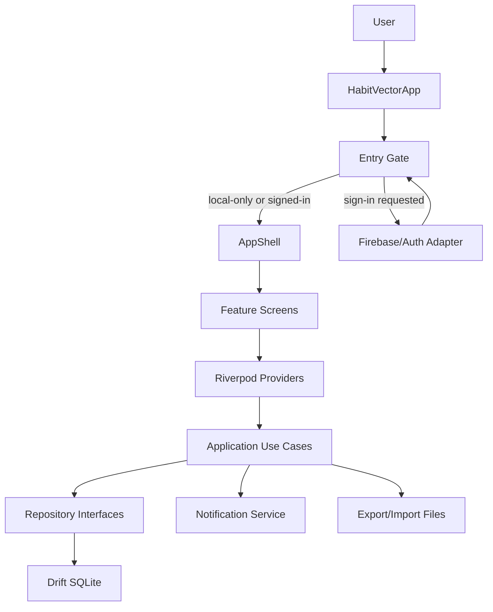
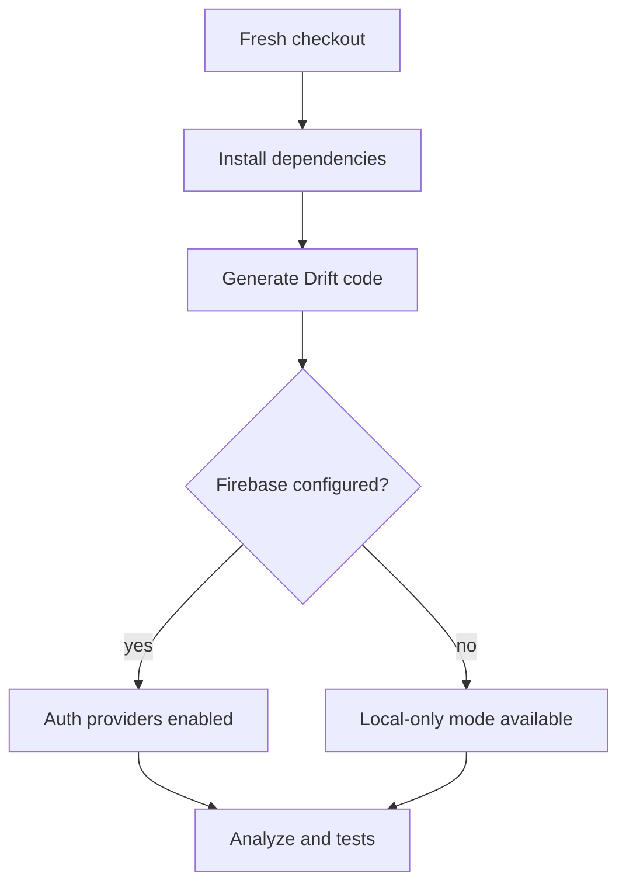

# feat: Harden Habit Vector Shippable Baseline

## Summary

This plan turns the current Habit Vector Flutter app into a shippable MVP baseline by closing the gap between the README's implemented-feature claims and the repository's actual build, configuration, auth, data, reminder, insights, and verification posture.

The active scope is the README's "Now" feature set. README "Later" ideas stay deferred unless they are needed to make the MVP coherent.

---

## Problem Frame

Habit Vector already has a clean layered Flutter structure, Drift-backed local habit storage, Firebase-auth surfaces, local notifications, onboarding, insights, export/import, theming, and platform projects. Several pieces are still scaffold-level or fragile: generated Drift code and Firebase options are absent, auth is mandatory despite the offline-first privacy positioning, notification setup depends on platform contracts, and tests cover core pieces but not the main cross-layer user journeys.

The implementation should stabilize what exists rather than redesigning the product.

---

## Requirements

**Build and Configuration**

- R1. The app must build from a fresh checkout after dependency installation and generated-code setup.
- R2. Firebase configuration must follow the current FlutterFire pattern while preserving graceful behavior when a developer has not configured Firebase locally.
- R3. Native Android and iOS configuration must match the notification, auth, and release-readiness surfaces the app claims.

**Core Habit Experience**

- R4. Users must be able to create, edit, archive, delete, complete, skip, and quantity-log habits without losing local data consistency.
- R5. Streaks, completion rates, heatmaps, and insights must reflect the app's schedule and log semantics for daily, specific-days, and custom-frequency habits.
- R6. Reminder creation, update, archive, delete, permission, and pending-notification flows must be reliable and testable.

**Identity and Privacy**

- R7. The app must support the offline-first privacy promise: local habit data remains usable even when Firebase is missing, unavailable, or the user chooses not to sign in.
- R8. Google and Apple sign-in must be real configured paths; Microsoft sign-in must be either completed or clearly scoped as disabled/deferred in UI and docs.

**Data Portability and UX**

- R9. JSON export/import must validate schema, preserve habit/log relationships, and handle conflicts predictably.
- R10. Onboarding, settings, accessibility labels, theme persistence, and error states must work across the authenticated and local-only paths.
- R11. The README and setup instructions must match the final repository behavior.

**Verification**

- R12. Feature-bearing implementation units must add focused unit, repository, widget, or integration-style tests that exercise user-visible behavior and platform-facing contracts where possible.

---

## Key Technical Decisions

- KTD1. Treat local habit data as the primary product surface: the README says habit data is local and auth is identity-only, so auth should not be the only path into the app.
- KTD2. Keep the existing layered architecture: domain entities and repositories stay pure, application use cases coordinate behavior, data repositories own Drift persistence, and presentation widgets use Riverpod providers.
- KTD3. Commit `pubspec.lock` and keep Drift output generated: this is an application, so dependency resolution should be reproducible, while `*.g.dart` remains generated by the documented setup flow unless the team deliberately changes that policy.
- KTD4. Encapsulate side effects behind testable seams: notifications, auth availability, file import/export, and shared preferences need provider-level overrides so cross-layer tests can run without real platform services.
- KTD5. Fix reminder lifecycle at the habit lifecycle boundary: create/update/archive/delete should schedule or cancel reminders as part of the habit workflow, not only from individual screens.
- KTD6. Prefer current official platform setup over stale scaffold assumptions: Firebase's Flutter guide initializes with `DefaultFirebaseOptions.currentPlatform`, and `flutter_local_notifications` documents Android desugaring, compile SDK, manifest, and exact-alarm behavior that must be reflected in the native projects.
- KTD7. Default reminders to inexact local notifications: habit reminders do not require alarm-clock precision, so the safer MVP posture is inexact scheduling without exact-alarm approval unless implementation uncovers a hard product reason to request it.
- KTD8. Treat configuration files as environment contracts, not secrets: document which Firebase/platform files are expected in source control, which are developer-local, and how OAuth provider credentials are managed outside the repository.

---

## High-Level Technical Design

The app should make entry-state decisions once, then let all main tabs work from local data. Firebase auth adds identity but should not own local habit availability.

Fresh-checkout verification should prove both configured and unconfigured developer states are intentional.

---

## Scope Boundaries

### In Scope

- Hardening the existing Flutter app and README MVP claims.
- Local-only entry, Firebase-auth readiness, and clear Microsoft sign-in handling.
- Drift generation, platform configuration, reminder lifecycle, data portability, insights, and test coverage.
- Android/iOS readiness checks needed to run and package the app locally.

### Deferred to Follow-Up Work

- Cloud habit sync or backup.
- Analytics events, Crashlytics, performance monitoring, or product pulse instrumentation.
- Home-screen widgets.
- App Store / Play Store submission, screenshots, privacy nutrition labels, and production signing automation.
- CSV export unless it is separately prioritized.
- Microsoft sign-in completion if Azure/Firebase credentials are not available during implementation.

---

## Implementation Units

### U1. Build and Generated-Code Baseline

- **Goal:** Make the repository buildable from a fresh checkout and remove ambiguity around generated/configured files.
- **Requirements:** R1, R2, R3, R11, R12.
- **Dependencies:** none.
- **Files:** `pubspec.yaml`, `pubspec.lock`, `.gitignore`, `lib/data/database/app_database.dart`, `lib/main.dart`, `README.md`, `test/data/repository_test.dart`.
- **Approach:** Remove `pubspec.lock` from ignored files and commit it after dependency resolution. Keep Drift output on the generated-code path already implied by `.gitignore`, but make that path explicit in setup and verification so a fresh checkout does not appear broken. Update Firebase initialization to use generated FlutterFire options when present while retaining a deterministic local-only fallback for unconfigured developers.
- **Patterns to follow:** `AppDatabase.forTesting` already supports in-memory Drift tests; README setup instructions already describe FlutterFire and build runner steps but need to match the final repo.
- **Test scenarios:**
  - Fresh repository dependencies resolve with a committed lockfile.
  - Drift repository tests compile against the generated database code.
  - Firebase initialization fallback leaves the app in local-only mode instead of crashing when Firebase options are absent.
  - Configured Firebase initialization path uses the generated options object when present.
- **Verification:** A fresh checkout can install dependencies, generate or use generated code, analyze, and run the existing repository tests without missing-part or missing-config failures.

### U2. Auth and Local-Only Entry Flow

- **Goal:** Align app entry with the offline-first privacy promise while preserving Firebase identity flows.
- **Requirements:** R2, R7, R8, R10, R12.
- **Dependencies:** U1.
- **Files:** `lib/main.dart`, `lib/domain/repositories/auth_repository.dart`, `lib/data/repositories/firebase_auth_repository.dart`, `lib/application/auth/auth_controller.dart`, `lib/presentation/providers/auth_providers.dart`, `lib/presentation/screens/auth/welcome_screen.dart`, `lib/presentation/screens/auth/sign_in_screen.dart`, `lib/presentation/screens/onboarding/onboarding_screen.dart`, `lib/presentation/screens/settings/settings_screen.dart`, `test/application/auth_controller_test.dart`, `test/presentation/auth_entry_flow_test.dart`.
- **Approach:** Introduce an explicit local-only/guest entry state instead of treating unauthenticated as a hard stop. Keep Firebase auth as an optional identity layer and make provider state distinguish unconfigured Firebase, signed-out local use, signing in, signed in, sign-in failure, and sign-out. Keep Microsoft sign-in deferred unless credentials are available during implementation; remove or disable the UI affordance so users do not mistake a stub for a working provider.
- **Patterns to follow:** Existing `_AuthGate`, `_OnboardingGate`, `AuthController`, and settings account card already centralize entry and account state.
- **Test scenarios:**
  - With no authenticated user and Firebase unavailable, the user can enter onboarding and then `AppShell`.
  - With a Firebase user, the user bypasses the welcome path and reaches onboarding or `AppShell` according to the stored onboarding flag.
  - Sign-in failure displays a recoverable error and does not block local-only app use.
  - Sign-out returns to local-only or welcome state without deleting local habit data.
  - Microsoft sign-in UI matches the chosen scope: disabled/deferred copy if not configured, or success/failure paths if implemented.
- **Verification:** App entry behavior is deterministic for first-run local-only, signed-out, signed-in, and Firebase-unconfigured states.

### U3. Habit Domain and Persistence Hardening

- **Goal:** Make habit/log persistence enforce the domain invariants used by the UI and insights.
- **Requirements:** R4, R5, R9, R12.
- **Dependencies:** U1.
- **Files:** `lib/domain/entities/habit.dart`, `lib/domain/entities/habit_log.dart`, `lib/domain/repositories/habit_repository.dart`, `lib/domain/repositories/habit_log_repository.dart`, `lib/data/database/app_database.dart`, `lib/data/mappers/habit_mapper.dart`, `lib/data/mappers/habit_log_mapper.dart`, `lib/data/repositories/drift_habit_repository.dart`, `lib/data/repositories/drift_habit_log_repository.dart`, `lib/application/use_cases/habit_use_cases.dart`, `lib/application/use_cases/log_use_cases.dart`, `test/data/repository_test.dart`, `test/application/log_use_cases_test.dart`, `test/application/habit_use_cases_test.dart`.
- **Approach:** Move validation and lifecycle invariants into use cases or repositories so screens do not become the only enforcement point. Check uniqueness for one log per habit/day, cascade behavior for habit deletion, archive behavior, schedule bounds, quantity target bounds, and date normalization. Replace `List<dynamic>` stream providers with typed streams after repository/use-case contracts are stable.
- **Patterns to follow:** Existing repository interfaces and mappers already separate domain entities from Drift rows.
- **Test scenarios:**
  - Creating a specific-days habit with no days fails before persistence.
  - Quantity habits require a positive numeric target and preserve unit text.
  - Marking done twice for the same habit/date updates one row rather than creating duplicates.
  - Logging quantity below target stores the value but marks the day incomplete.
  - Skipping a completed habit clears completion consistently.
  - Deleting a habit removes or prevents orphaned logs according to the chosen repository contract.
  - Typed providers return `List<Habit>` and `List<HabitLog>` without UI casts.
- **Verification:** Data and use-case tests prove the same invariants regardless of which screen initiates the action.

### U4. Reminder Permission and Lifecycle Integration

- **Goal:** Make local notifications reliable across create, edit, archive, delete, permission, and platform lifecycle boundaries.
- **Requirements:** R3, R4, R6, R10, R12.
- **Dependencies:** U1, U3.
- **Files:** `lib/data/services/notification_service.dart`, `lib/application/use_cases/habit_use_cases.dart`, `lib/presentation/providers/providers.dart`, `lib/presentation/screens/habits/add_edit_habit_screen.dart`, `lib/presentation/screens/habits/habit_detail_screen.dart`, `lib/presentation/screens/settings/settings_screen.dart`, `android/app/build.gradle.kts`, `android/app/src/main/AndroidManifest.xml`, `ios/Runner/Info.plist`, `test/application/habit_reminder_lifecycle_test.dart`, `test/data/notification_service_test.dart`, `test/presentation/settings_notifications_test.dart`.
- **Approach:** Put scheduling/cancellation behind a habit lifecycle service or use-case dependency so all create/update/archive/delete paths are covered. Add injectable notification adapters for tests. Align Android Gradle and manifest with `flutter_local_notifications` requirements, including desugaring and notification permission posture. Remove exact-alarm permission by default because the service uses inexact daily reminders; add an exact-alarm request only if the product later requires exact delivery. On iOS, request only the permissions the app uses and remove unrelated background modes unless another feature needs them.
- **Patterns to follow:** `NotificationService` is already a singleton behind `notificationServiceProvider`; habit screens already call it in some paths.
- **Test scenarios:**
  - Creating a habit with two reminders schedules two deterministic pending notifications.
  - Editing reminder times cancels old reminder IDs and schedules the new set.
  - Archiving a habit cancels reminders; unarchiving with reminder times schedules them again if that is the chosen behavior.
  - Deleting a habit cancels reminders before removing local data.
  - Permission denial shows user-actionable settings copy and does not prevent saving the habit.
  - Android exact-alarm permission is absent for the inexact-reminder MVP; if exact scheduling is later chosen, the app requests the platform permission before scheduling exact alarms.
- **Verification:** Reminder behavior is testable without real platform notifications, and native project files match the selected notification posture.

### U5. Export/Import and Data Recovery Flow

- **Goal:** Make backup/restore safe enough for user data portability.
- **Requirements:** R9, R10, R12.
- **Dependencies:** U3.
- **Files:** `lib/application/use_cases/export_import_use_cases.dart`, `lib/presentation/screens/settings/settings_screen.dart`, `test/application/export_import_use_cases_test.dart`, `test/presentation/settings_import_export_test.dart`.
- **Approach:** Formalize the JSON schema version, validation errors, conflict behavior, and import atomicity. Import should run inside a database transaction so persistence failure leaves pre-existing data unchanged. Matching habit IDs should update in place, duplicate logs for a habit/date should update the existing row, and unknown future schema versions should be rejected with a clear error until a migration path exists.
- **Patterns to follow:** `ExportData`, `ImportValidation`, and settings dialogs already provide a natural validation-confirm-import flow.
- **Test scenarios:**
  - Export includes active and archived habits plus all associated logs.
  - Validation rejects missing `habits`, `logs`, or `exportedAt` fields with specific errors.
  - Validation rejects logs referencing absent habits.
  - Import with an existing habit ID updates the habit without duplicating logs for the same date.
  - Import failure during persistence leaves pre-existing data unchanged or reports a clear partial-failure contract.
  - Settings import dialog shows validation errors and invalidates providers only after successful import.
- **Verification:** Backup files round-trip through export, validation, and import with predictable results.

### U6. Insights, Streaks, and Date Semantics

- **Goal:** Make insights and streak views trustworthy across the supported schedule types.
- **Requirements:** R5, R10, R12.
- **Dependencies:** U3.
- **Files:** `lib/application/use_cases/streak_calculator.dart`, `lib/presentation/screens/insights/insights_screen.dart`, `lib/presentation/screens/habits/habit_detail_screen.dart`, `lib/presentation/screens/habits/widgets/calendar_heatmap.dart`, `test/application/streak_calculator_test.dart`, `test/application/insights_calculation_test.dart`, `test/presentation/insights_screen_test.dart`, `test/presentation/habit_detail_screen_test.dart`.
- **Approach:** Centralize derived insight calculations outside the screen where practical so they are unit-testable. Clarify how skipped days affect streaks and completion rates, how current-week custom-frequency habits behave before the week is complete, and whether "Needs Attention" should include habits with no due days in the period.
- **Patterns to follow:** `StreakCalculator` already owns schedule-specific calculations; `InsightsScreen` currently duplicates completion-rate logic inline.
- **Test scenarios:**
  - Daily streak current/longest calculations remain stable with today, yesterday, gaps, skipped days, and quantity values.
  - Specific-days habits count only scheduled days in streaks and completion rates.
  - Custom-frequency habits count complete weeks according to ISO week starts and handle the in-progress current week consistently.
  - Weekly and monthly chart values reflect due habits only.
  - Best-performing and needs-attention lists handle ties, no logs, archived habits, and no active habits.
  - Heatmap displays completed, skipped, and empty dates with distinct semantics.
- **Verification:** Insight views and calculations use one shared semantic model and no longer depend on untested screen-local math.

### U7. UI, Accessibility, and State Polish

- **Goal:** Make the MVP screens resilient, accessible, and consistent with the existing design system.
- **Requirements:** R4, R7, R8, R10, R12.
- **Dependencies:** U2, U3, U5, U6.
- **Files:** `lib/presentation/theme/app_theme.dart`, `lib/presentation/screens/home/home_screen.dart`, `lib/presentation/screens/home/widgets/habit_tile.dart`, `lib/presentation/screens/habits/add_edit_habit_screen.dart`, `lib/presentation/screens/habits/habits_list_screen.dart`, `lib/presentation/screens/habits/habit_detail_screen.dart`, `lib/presentation/screens/insights/insights_screen.dart`, `lib/presentation/screens/settings/settings_screen.dart`, `lib/presentation/screens/auth/welcome_screen.dart`, `lib/presentation/screens/auth/sign_in_screen.dart`, `test/presentation/home_screen_test.dart`, `test/presentation/add_edit_habit_screen_test.dart`, `test/presentation/habits_list_screen_test.dart`, `test/presentation/settings_screen_test.dart`.
- **Approach:** Audit loading, empty, error, disabled, and permission-denied states across the main screens. Replace dynamic casts with typed provider data in presentation. Fix misleading sort/filter options, long-text handling, semantic labels, and terms/privacy TODO surfaces.
- **Patterns to follow:** Existing screens use Material 3 widgets, `AppTheme` constants, cards, segmented controls, haptics, and provider invalidation.
- **Test scenarios:**
  - Home screen shows empty, due-today, no-due-today, completed, skipped, and quantity states.
  - Add/edit form validates title, schedule days, quantity target, and reminder entries before saving.
  - Habit list search/filter/sort options match their labels; unsupported sort options are removed or implemented.
  - Settings account section adapts for local-only and signed-in users.
  - Auth screens expose local-only entry when enabled and do not show unavailable provider actions as working.
  - Large text scale does not make critical habit actions unreachable.
- **Verification:** Main screens can be widget-tested through representative states without depending on real Firebase, notifications, or file pickers.

### U8. Documentation and Release Readiness

- **Goal:** Make setup, verification, and release-facing project state honest and repeatable.
- **Requirements:** R1, R2, R3, R8, R11, R12.
- **Dependencies:** U1 through U7.
- **Files:** `README.md`, `android/app/build.gradle.kts`, `android/settings.gradle.kts`, `android/app/src/main/AndroidManifest.xml`, `ios/Runner/Info.plist`, `ios/Podfile`, `pubspec.yaml`, `pubspec.lock`, `tool/generate_splash_pngs.dart`, `assets/images/splash_logo.png`, `assets/images/splash_logo_dark.png`, `test/presentation/widget_test.dart`.
- **Approach:** Update README claims to distinguish implemented, configured, optional, and deferred features. Replace placeholder release TODOs with explicit local-development defaults and production-readiness notes. Check splash assets, app identifiers, signing placeholders, notification permissions, Firebase service files, and platform support minimums.
- **Patterns to follow:** README already has setup, architecture, verification, pitfalls, and now/later sections that can be corrected rather than replaced.
- **Test scenarios:**
  - README setup steps match actual fresh-checkout commands and generated/configured file expectations.
  - Verification checklist maps to real tests or manual platform checks.
  - Placeholder splash assets are either replaced or documented as required pre-release work.
  - Release build signing and app identifier TODOs are documented as non-MVP blockers or converted into real project settings.
  - Native platform permission declarations match features used by the Dart code.
  - Firebase and OAuth setup docs distinguish non-secret generated config identifiers from credentials that must stay out of source control.
- **Verification:** A new developer can follow README setup and understand which capabilities require Firebase, Apple, Azure, notification permissions, or production signing.

---

## System-Wide Impact

- **Data lifecycle:** Local SQLite remains the source of truth for habit data; import/export and deletion behavior must preserve referential integrity.
- **Auth boundary:** Auth becomes optional identity rather than a gate around local habit data.
- **Platform contracts:** Notifications and Firebase require Android/iOS project changes, not just Dart code.
- **Test architecture:** Provider overrides become the main seam for isolating platform services in widget and application tests.
- **Documentation:** README shifts from aspirational scaffold notes to operational setup and verification truth.
- **Dependency reproducibility:** `pubspec.lock` becomes part of the app baseline; generated Drift files remain reproducible outputs of the documented generation step.

---

## Risks & Dependencies

- **Firebase credentials are external:** Google/Apple sign-in cannot be fully proven without platform Firebase app configuration and provider setup. Keep local-only mode testable and document credential-dependent manual checks.
- **Notification APIs vary by Android version:** Android exact alarms and notification permissions require a conscious product choice. The plan should prefer inexact reminders unless exact timing is genuinely required.
- **Generated Drift output may be stale:** Regenerating database code can surface compile issues in mappers and tests; resolve those before feature hardening.
- **Current tests use wall-clock time:** Streak tests depend on `DateTime.now()`, so hardening may require injecting a clock to avoid date-sensitive flakes.
- **Import is data-destructive if poorly handled:** Add validation and transaction behavior before broadening import UI confidence.
- **OAuth provider UI can overpromise:** A visible Microsoft button with a stubbed backend weakens trust; defer or disable it until Azure and Firebase provider setup are available.
- **Configuration files can be misunderstood as secrets:** Document source-control policy for `firebase_options.dart`, Android/iOS Firebase service files, and provider credentials so developers do not commit real OAuth secrets or omit required non-secret identifiers by accident.

---

## Acceptance Examples

- AE1. Given a fresh checkout with no Firebase project configured, when the developer installs dependencies and follows the documented generation step, then the app builds and opens into a local-only path instead of failing at Firebase initialization.
- AE2. Given a local-only first-time user, when they complete onboarding with sample habits, then the Today, Habits, Insights, and Settings tabs all work without authentication.
- AE3. Given a habit with reminders, when the user edits, archives, unarchives, or deletes it, then pending notifications match the habit's current active state.
- AE4. Given an exported JSON backup, when the user imports it on another clean local database, then habits and logs round-trip without orphaned logs or duplicate same-day logs.
- AE5. Given daily, specific-days, and custom-frequency habits with representative logs, when the user opens details and insights, then streaks, completion rates, rankings, and heatmap states match the documented schedule semantics.

---

## Documentation / Operational Notes

- Update README setup so it no longer instructs developers to rely on `Firebase.initializeApp()` without `DefaultFirebaseOptions.currentPlatform`.
- Document whether `app_database.g.dart` is committed or generated locally; make the verification checklist match that policy.
- Document Firebase provider prerequisites separately from local-only use.
- Document source-control treatment for Firebase configuration and OAuth provider credentials.
- Document notification permission behavior and Android exact-alarm posture.
- Keep app-store submission, production signing, privacy labels, and cloud backup outside this MVP hardening plan unless separately requested.

---

## Sources / Research

- `README.md` defines the intended MVP feature set, setup instructions, and now/later scope.
- `lib/main.dart` currently gates the app on auth state and initializes Firebase without generated options.
- `lib/data/database/app_database.dart` references generated Drift code that is absent from the checkout.
- `lib/data/services/notification_service.dart` implements reminder scheduling but relies on platform setup and is only partially integrated into habit lifecycle screens.
- `lib/application/use_cases/export_import_use_cases.dart` implements JSON backup/restore but needs stronger schema, conflict, and transaction semantics.
- `test/application/streak_calculator_test.dart`, `test/data/repository_test.dart`, and `test/presentation/widget_test.dart` provide a useful base but do not cover the main app entry and lifecycle flows.
- Firebase Flutter setup docs state that `flutterfire configure` creates `firebase_options.dart` and show initialization with `DefaultFirebaseOptions.currentPlatform`: https://firebase.google.com/docs/flutter/setup.
- `flutter_local_notifications` package docs call out Android desugaring, compile SDK, manifest setup, notification permission, and exact-alarm behavior for scheduled notifications: https://pub.dev/packages/flutter_local_notifications.
